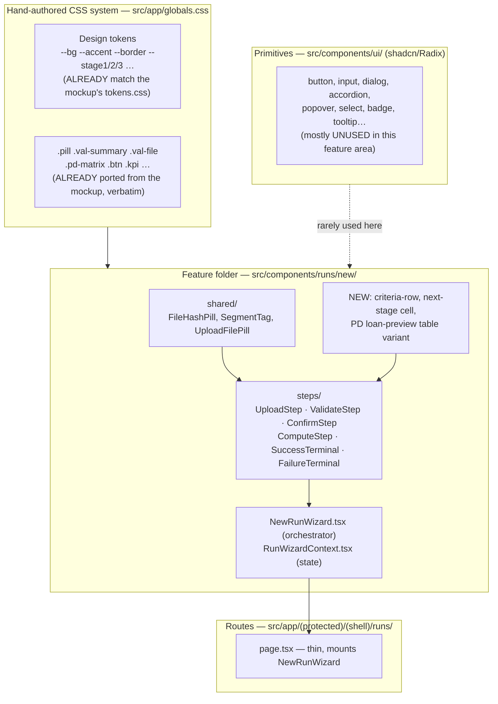
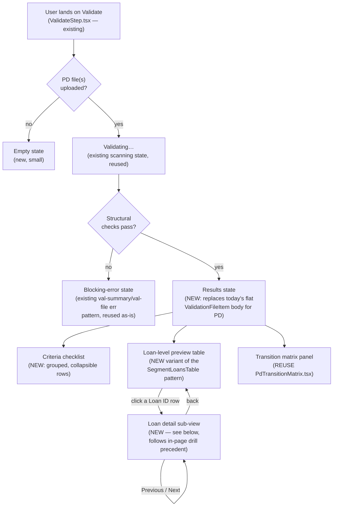

# PD-First Validation — Integration Prompt for Cursor

**How to use this document:** paste this into Cursor alongside the finished mockup at `references/v2/Flow 5 - New Run.html` (open it in a browser first and click through all six states — Upload, Validate, Confirm, Compute, Done, Fail — before touching any code). This is the integration brief: it tells you *what already exists in the real app, what's genuinely new, and how the two must fit together*. It does not contain code — that is the implementation work this prompt hands to you.

---

## 1. Mission

Integrate the new PD-first validation experience — already fully designed and verified in `ECL-Web/references/v2/Flow 5 - New Run.html` — into the real "New Run" wizard at `ECL-Web/src/components/runs/new/`. This is not a redesign and not a rebuild: it is a careful, targeted integration into a production Next.js app that already implements five of the six wizard screens correctly. Two documents give you the "why" and the original "how it should look"; read them before this one if you need the background:

- `ECL/PD_VALIDATION_REDESIGN.md` — the functional specification: why PD validates independently, the full criteria list (EC-02 through EC-18), and the backend contract this UI ultimately depends on.
- `ECL-Web/references/PD_FIRST_VALIDATION_DESIGN_BRIEF.md` — the original visual brief that produced the mockup.

This document is the third leg: *how the finished mockup maps onto the actual React codebase*, file by file, so nothing gets rebuilt that already exists and nothing gets bolted on inconsistently.

---

## 2. Execution Instructions — Work Bottom-Up, Verify Before You Build

The user's framing for this work is "atoms → molecules → organisms → routes" — build from the smallest reusable piece upward, carefully, so nothing breaks. **Important correction before you start**: this codebase does not use literal `atoms/`/`molecules/`/`organisms/` folders. Do not create them. The real layering is: shadcn/ui primitives in `src/components/ui/`, feature folders per domain (`src/components/runs/new/`, `src/components/results/`, etc.), and a hand-authored CSS class/token system in `src/app/globals.css` that most of this feature area is built on instead of Tailwind utilities or shadcn components. Honor *that* structure — it is the codebase's real "atomic" system, it's just not named that.

Work in this order, and treat each stage as a checkpoint before moving to the next:

1. **Research pass — re-verify, don't assume.** Code moves faster than any document, including this one. Before writing anything, re-read the current contents of every file named in Section 3 directly from disk. If something in this brief no longer matches what you find, the live file is correct, not this document — note the discrepancy and proceed from reality.
2. **Interaction pass — answer "what happens when I click this?" for every clickable element in the mockup.** Go through `references/v2/Flow 5 - New Run.html` systematically: every button, tab, table row, accordion header, and pagination control. For each one, write down (to yourself, before coding) which React state change, which existing function, or which new function it must trigger in the real app. Section 4 gives you the answer for most of them; use the same method for anything Section 4 doesn't cover.
3. **Styling pass** — fill the specific, narrow CSS gap identified in Section 6. Do this first because everything else depends on the classes existing.
4. **Small-piece pass** — build the new, genuinely reusable sub-components (the criteria-checklist row/group, the next-stage cell, the loan-preview table variant) as their own components, following the manual-disclosure and pagination patterns already established elsewhere in this codebase (Section 3), not a new pattern and not the unused shadcn Accordion.
5. **Assembly pass** — wire the new small pieces into `ValidateStep.tsx` and `ValidationFileItem.tsx` (or their PD-specific extensions), alongside the reused `PdTransitionMatrix`.
6. **Data-layer pass** — extend the types and mapper per Section 5, coordinating with (or mocking against) the backend contract.
7. **Verification pass** — Section 8's definition of done, including a real click-through of every state on a phone-width viewport, not just desktop.

If you have the ability to parallelize work across multiple agents or sessions, split along these same seams — one on the CSS/small-component layer, one on the data/type layer, one on the assembly/wiring — but the styling pass must land before the others depend on it, and the assembly pass must come last.

---

## 3. Ground Truth — The Real Codebase, As It Actually Is

### 3.1 Component layering (verified — not the atomic-folder structure you might expect)

The single most important fact for this integration: **`globals.css` already defines the same custom-property tokens as the mockup, with the same names and the same hex values** (`--accent: #6D4AFF`, `--border: #E7E7EE`, and so on), and it already contains verbatim ports of many of the mockup's component classes — `.pill` and its `-success`/`-warning`/`-danger` variants, `.val-summary`, `.val-file`/`.vf-head`, `.pd-matrix` and its cell/legend classes, `.btn`/`.btn-primary`/`.btn-secondary`, `.kpi`. **Do not re-port the design system — it's already there.** Your CSS work is narrow (Section 6).

### 3.2 Per-step build state — what's real, what's new

| Step | File(s) | State |
|---|---|---|
| Upload | `steps/UploadStep.tsx` (321 lines) | Fully implemented: draft-run creation, real per-file upload with progress, add/remove for PD (multi)/LGD/EAD (single), template download, run-name binding. **New work**: the PD zone needs the mockup's independent "Validate PD" action + status pill — this doesn't exist yet. |
| Validate | `steps/ValidateStep.tsx` (300 lines), `ValidationFileItem.tsx` (151 lines), `ValidationSummary.tsx` (98 lines) | Fully implemented for today's flat-issue-list behavior: calls the validate endpoint, maps the result, renders scanning/results states, handles re-upload and warning-acceptance. **This is where nearly all the new work lives** — see 3.3 and Section 4.2. `ValidationFileItem.tsx` currently has no concept of grouped pass/review criteria, a loan table, or a matrix; it's a flat issue list today. |
| Confirm | `steps/ConfirmStep.tsx` (33 lines, thin) + `ConfirmGrid.tsx` (105 lines, fully built) | Already functionally complete. Expect **no new work** — just confirm it still visually matches the mockup's Confirm screen (the mockup carried this screen forward from the prior version essentially unchanged). |
| Compute | `steps/ComputeStep.tsx` (144 lines) | Fully implemented: fires execute, polls every 2s, maps engine progress, timeout and retry handling. **No functional rework** — verify visual parity only. |
| Success / Failure | `steps/SuccessTerminal.tsx` (96 lines) / `steps/FailureTerminal.tsx` (130 lines) | Fully implemented terminal screens with real KPI display, download, and retry actions. **No functional rework** — verify visual parity only. |

### 3.3 Reuse these — don't rebuild them

- **`src/components/results/segment/PdTransitionMatrix.tsx`** — already renders exactly the matrix markup the mockup's Validate screen needs (same `.pd-matrix`/legend classes, animated cell reveal, color-mix tinting). It currently takes a post-compute matrix as a prop. Reuse this component as-is for the new Validate-screen panel; the only change is *what matrix data feeds it* — a preview matrix computed from the uploaded-but-not-yet-executed PD file, not a finished run's results.
- **`src/components/results/segment/SegmentLoansTable.tsx`** — this is the app's one canonical pagination pattern (Prev/Next buttons, page/totalPages state, `.fbtn` styling) and its client-side filter pattern. Reuse the *pattern*, not the component directly — its columns are ECL-focused (PD/LGD/EAD/ECL), while the mockup's Validate-screen table needs Loan ID/Segment/Reporting month/Staging/**Next month staging**. Build a sibling variant that follows the same pagination/filter shape.
- **The disclosure pattern** used throughout this feature area — including in `ValidationFileItem.tsx` itself, and in the mockup's own vanilla JS — is a manual `open` boolean toggled on click, not a component library. The shadcn `Accordion` exists in `src/components/ui/accordion.tsx` but has essentially no adoption in this feature area (only one unrelated use in a marketing FAQ). **Follow the manual pattern for the new criteria-checklist groups**, for visual and behavioral consistency with everything around it — but see Section 8 for the one thing that pattern is currently missing (keyboard/ARIA support) that you should add this time rather than copy forward.
- **Loan drill-down** in the existing Results Explorer is **in-page component state** (a "which loan is selected" state variable driving a view swap), not a Next.js route or URL change. Follow this same approach for the new loan-click-to-detail interaction (Section 4.2) rather than introducing routing for it — that would be an inconsistent, one-off pattern.

---

## 4. Step-by-Step Integration Map

### 4.1 Upload — small, additive change

Everything about file upload, drag-drop, and template download already works and should not be touched. The one new piece: the PD upload zone needs an independent action, available as soon as at least one PD file is present and not gated on LGD/EAD — a status pill ("Validated · N passed, M to review") and a button that jumps straight to the Validate screen's PD section. This mirrors the mockup exactly: open the mockup's Upload screen, look at the PD zone, and reproduce that specific addition — everything else on that screen is unchanged.

### 4.2 Validate — the core of this integration

Build, in this order:

1. **Criteria checklist.** A group header (icon, title, an aggregate pill showing pass/review count, a chevron) and, inside it, one row per criterion (a pass/review pill, the check's name, and a one-line plain-language reason). Two groups: structural (collapsed by default, since it's the passthrough case) and business/statistical (expanded by default, since it's what a reviewer actually needs to see). This is new UI with no existing component to extend — build it as a small, self-contained pair of components (group, row) styled with the CSS added in Section 6, following the manual-disclosure pattern from Section 3.3.
2. **Loan-level preview table.** Columns: Loan ID, Segment, Reporting month, Staging, **Next month staging** — the last column shows the current stage, an arrow, and the computed next-month stage, color-coded the same way the existing stage badges are. Include the segment-tab switcher and the loan-ID search input the mockup shows above the table. Build this as a sibling to `SegmentLoansTable`, reusing its pagination shape (Section 3.3) rather than its column set.
3. **Loan detail sub-view — new scope, no mockup reference.** The user has asked, beyond what the mockup shows, for each loan row's ID to be clickable, opening a detail view for that loan, with Previous/Next navigation between loans. Since there's no visual reference for this specific piece, design it from the existing precedent: follow the Results Explorer's in-page drill pattern (Section 3.3) — a "currently selected loan" state that swaps the table view for a detail view, not a new route. The data available at this point is pre-compute (staging history across the uploaded reporting months for that loan, not a full PD×LGD×EAD ECL decomposition, since LGD/EAD haven't been uploaded yet at this stage) — so this detail view is closer in spirit to a compact version of `MonthlyRundownTable.tsx` scoped to staging/next-staging per month, not the full `LoanView.tsx`/`EclDecompositionChain.tsx` used post-compute. Previous/Next should step through the currently-filtered/sorted loan list, matching the same list order the table is showing.
4. **Transition matrix panel.** Reuse `PdTransitionMatrix.tsx` directly (Section 3.3), fed a matrix computed from the uploaded PD data at validate-time rather than a finished run's results, plus the cure-rate/loans-observed/months-of-history stats shown as `.kpi` cards next to it (matching the mockup).
5. **Pending LGD/EAD rows.** Unchanged, dimmed rows underneath — this part of `ValidationFileItem.tsx`'s existing rendering for not-yet-uploaded files needs no change.

### 4.3 Confirm, Compute, Success, Failure

No functional work expected. Open each of these screens in both the mockup and the running app side by side and confirm they still match — if they don't, that's a regression to fix, not new scope.

---

## 5. Data / Type / API Layer

`ValidationResult`, `ValidationFileResult`, and `ValidationIssue` (`src/lib/new-run-types.ts`), the raw types and `validateRun()` (`src/lib/api/runs.ts`), and `mapValidationResult()` (`src/lib/api/mappers.ts`) are **issues-only today** — none of them have any concept of a grouped criterion, a pass/review outcome, a preview matrix, or loan-level preview rows. This is a genuine extension, not an adaptation: new fields need to be added end-to-end through this whole chain (raw type → mapper → mapped type → component props).

**Important dependency**: the shape this extension should target is the one already specified in `PD_VALIDATION_REDESIGN.md` §6.3 (a `criteria` list and a `pd_preview` object) — but that backend work has not been built yet in `ECL-Server`. Don't block on it: implement the frontend against that target shape with clearly-marked mock/stub data (so it's obvious what's real and what's a placeholder), and design the mapper so swapping in the real endpoint later is a small, isolated change, not a rewrite. Flag this dependency explicitly rather than silently assuming the backend is ready — confirm with whoever owns the backend work before this ships end-to-end.

Also note: `validateRun()` currently has a 180-second timeout. If the real backend work eventually moves the preview computation into this same call (per the backend spec), that timeout may need revisiting — not your call to make unilaterally, but worth flagging alongside the mock-data note above.

---

## 6. Styling Integration — A Narrow, Specific Gap

Do not re-create the design system — it's already in `globals.css`, matching the mockup's tokens and most of its component classes verbatim. The gap, confirmed by direct search (zero existing hits for these), is specifically:

- The criteria-checklist group/row classes (the mockup's `.crit-group`, `.crit-group-head`, `.crit-body`, `.crit-row`, and their sub-part classes).
- The next-stage cell pattern (the mockup's `.next-stage`, pairing an arrow with a stage badge).

Add these to `globals.css`, following the exact same authoring convention already used for every sibling class around them (plain hand-written CSS referencing the existing custom properties — not Tailwind utility classes, not a CSS module, not styled-components).

One reconciliation to make, not just copy: the real app already has its own stage-badge convention (`StageBadge` component, `.stage-badge`/`.stage-badge-1/2/3` classes) which differs in naming from the mockup's raw `.stage`/`.stage-1/2/3` classes. **Use the app's existing `StageBadge` component and its naming**, not the mockup's raw class names, for both the Staging and Next Month Staging columns — that keeps the new table consistent with how every other screen in the app already shows a stage.

---

## 7. Responsiveness

Research the app's own existing responsive breakpoints and shell behavior (how the sidebar, topbar, and existing data tables in `results/` already adapt on smaller screens) and follow that — do not assume the static mockup's 1024px/768px breakpoints are what the live app actually uses; verify against the real app shell first. At minimum, explicitly verify on a phone-width viewport: the loan-level preview table degrades to a readable stacked/card layout rather than horizontal scroll (matching how the mockup handles this), the criteria-checklist groups remain legible and tappable, and the loan detail sub-view (Section 4.2 item 3) works with touch-sized Previous/Next controls.

---

## 8. Definition of Done

- Every interaction mapped in Section 4 works exactly as described, verified against the mockup screen by screen.
- `PdTransitionMatrix.tsx` is reused, not reimplemented; the loan table follows `SegmentLoansTable`'s pagination pattern rather than inventing a new one; the criteria checklist follows the existing manual-disclosure pattern.
- Unlike the existing disclosure pattern elsewhere in this feature area (which lacks it), the **new** criteria-group and file-row toggles are keyboard-operable and expose their expanded/collapsed state to assistive technology (the accessible-disclosure equivalent of `role="button"`, a way to reach and activate it by keyboard, and a way for a screen reader to know whether it's open) — fix this here rather than copying the gap forward.
- Stage display uses the app's existing `StageBadge` component/naming, not the mockup's raw class names.
- The new frontend types/mapper extension is isolated enough that swapping mock data for the real backend endpoint (once built) doesn't require touching the components that consume it.
- Verified responsive at phone width, not just desktop, per Section 7.
- Upload, Confirm, Compute, Success, and Failure all still work exactly as they did before this change — no regressions.

---

## 9. Explicit Non-Goals

- LGD and EAD keep today's behavior unchanged — this integration is PD-only, matching `PD_VALIDATION_REDESIGN.md` §8's phasing.
- No backend code changes — that's `ECL-Server`, a separate repository and a separate piece of work. This prompt covers `ECL-Web` only.
- No new Next.js routes for loan drill-down — it's in-page state, per Section 3.3.
